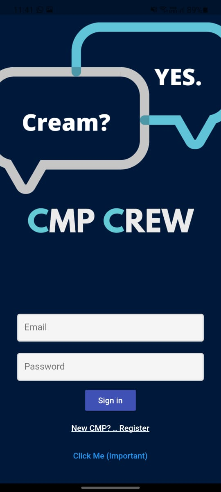
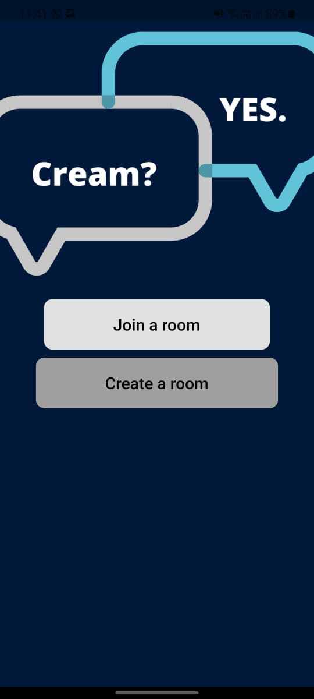
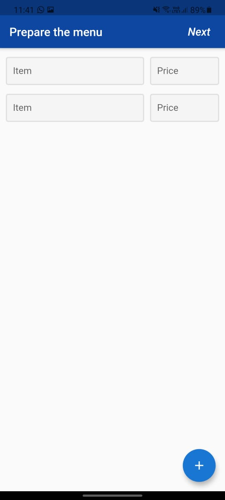
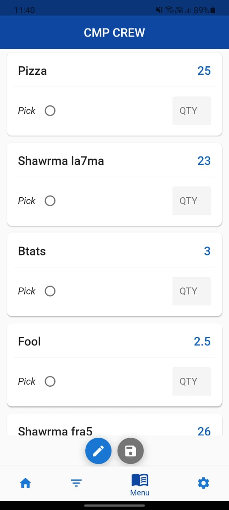
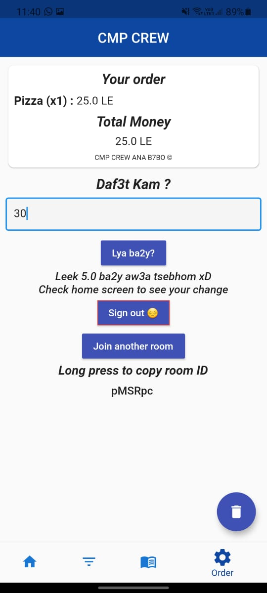
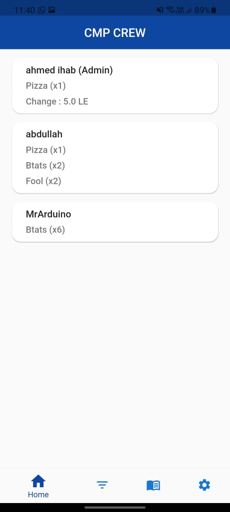
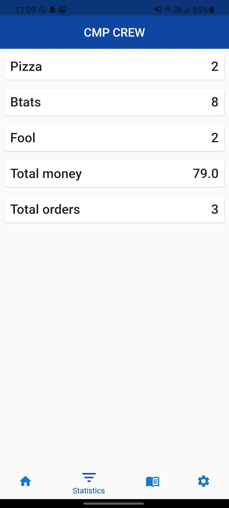

<html><H1 align="center">

CMP CREW
 </H1>
<H1 align="center">

Tired of collecting your friends’ orders at restaurants? Lost track of how many of you want tea? Don’t worry we got you covered! Use CMP Crew, Create a room, invite your friends to join, and let them add their orders to the shared menu!

## Sign in Screen

  

 
 ## Choose whether to join or create room

  

 
 ## If you are creating room you will specify the menu

  

 
 ## Menu screen to make your order

  

 
 ## Order screen to view your order and payment

  

 
 ## Home screen to see your friends orders

  

 
  ## Statistics screen to see total money and orders

  

 
 
 
